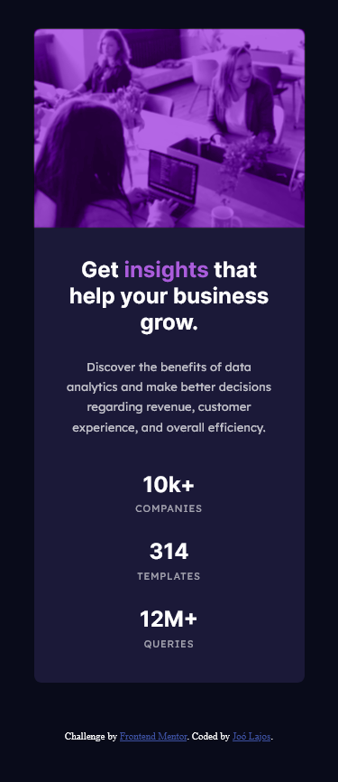
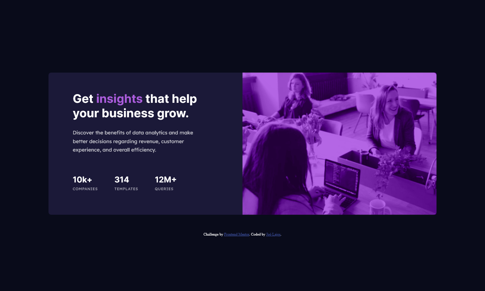

# Frontend Mentor - Stats preview card component solution

This is a solution to the [Stats preview card component challenge on Frontend Mentor](https://www.frontendmentor.io/challenges/stats-preview-card-component-8JqbgoU62). Frontend Mentor challenges help you improve your coding skills by building realistic projects. 

## Table of contents

- [Overview](#overview)
  - [The challenge](#the-challenge)
  - [Screenshot](#screenshot)
  - [Links](#links)
- [My process](#my-process)
  - [Built with](#built-with)
  - [What I learned](#what-i-learned)
- [Author](#author)

## Overview

### The challenge

Users should be able to:

- View the optimal layout depending on their device's screen size

### Screenshot




### Links

- Solution URL: [Add solution URL here](https://your-solution-url.com)
- Live Site URL: [Add live site URL here](https://your-live-site-url.com)

## My process

### Built with

- Semantic HTML5 markup
- SCSS custom properties
- Flexbox
- Mobile-first workflow

### What I learned

Probably it could be solve the task without a filter, but I hope this is good too.

```css
.img-filter {
    position: relative;
    border-top-left-radius: 0.5rem;
    border-top-right-radius: 0.5rem;

    &::after {
        position: absolute;
        content: '';
        top: 0;
        left: 0;
        width: 100%;
        height: 100%;
        background: hsl(277, 64%, 61%);
        mix-blend-mode: color;
    }
}

.card-image {
    width: 100%;
    height: 100%;
    display: block;
    border-top-left-radius: 0.5rem;
    border-top-right-radius: 0.5rem;
    filter: blur(0.3px) opacity(0.5) sepia(1);
}
```

## Author

- Frontend Mentor - [@MonolithDragon](https://www.frontendmentor.io/profile/MonolithDragon)

